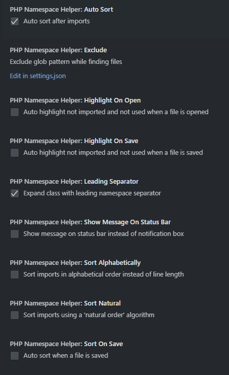

# PHP Namespace Helper

PHP Namespace Helper can import and expand your class. You can also sort your imported classes by line length or in alphabetical order.

## Demo


## Commands

Search these commands by the title on command palette.

```javascript
[
  {
    title: "Import Class",
    command: "phpNamespaceHelper.import",
  },
  {
    title: "Import All Classes",
    command: "phpNamespaceHelper.importAll",
  },
  {
    title: "Expand Class",
    command: "phpNamespaceHelper.expand",
  },
  {
    title: "Sort Imports",
    command: "phpNamespaceHelper.sort",
  },
  {
    title: "Generate namespace for this file",
    command: "phpNamespaceHelper.generateNamespace",
  },
];
```

## Settings



You can override these default settings according to your needs.

```javascript
{
    "phpNamespaceHelper.exclude": "**/node_modules/**",  // Exclude glob pattern while finding files
    "phpNamespaceHelper.showMessageOnStatusBar": false,  // Show message on status bar instead of notification box
    "phpNamespaceHelper.autoSort": true,                 // Auto sort after imports
    "phpNamespaceHelper.sortOnSave": false,              // Auto sort when a file is saved
    "phpNamespaceHelper.sortAlphabetically": false,      // Sort imports in alphabetical order instead of line length
    "phpNamespaceHelper.sortNatural": false,             // Sort imports using a 'natural order' algorithm
    "phpNamespaceHelper.leadingSeparator": true,         // Expand class with leading namespace separator
}
```

## Keybindings

You can override these default keybindings on your `keybindings.json`.

```javascript
[
  {
    command: "phpNamespaceHelper.import",
    key: "ctrl+alt+i",
    when: "editorTextFocus",
  },
  {
    command: "phpNamespaceHelper.importAll",
    key: "ctrl+alt+a",
    when: "editorTextFocus",
  },
  {
    command: "phpNamespaceHelper.expand",
    key: "ctrl+alt+e",
    when: "editorTextFocus",
  },
  {
    command: "phpNamespaceHelper.sort",
    key: "ctrl+alt+s",
    when: "editorTextFocus",
  },
  {
    command: "phpNamespaceHelper.generateNamespace",
    key: "ctrl+alt+g",
    when: "editorTextFocus",
  },
];
```

## Author

- [@vdhoangson](https://twitter.com/vdhson)

## License

Copyright (c) 2023 vdhoangson
